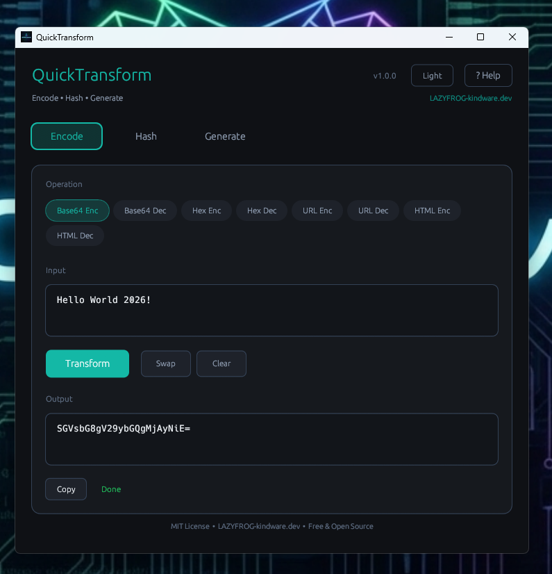
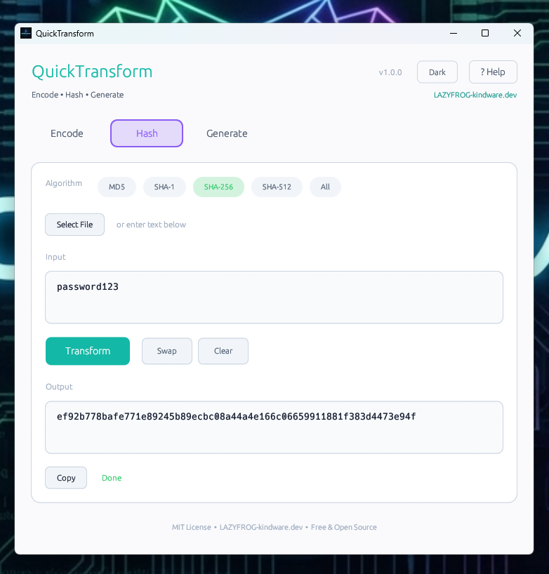
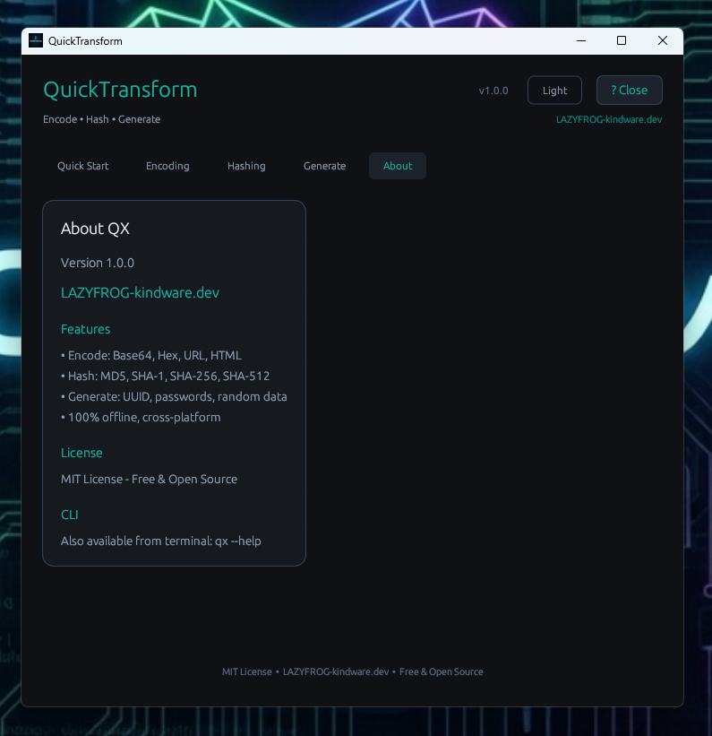
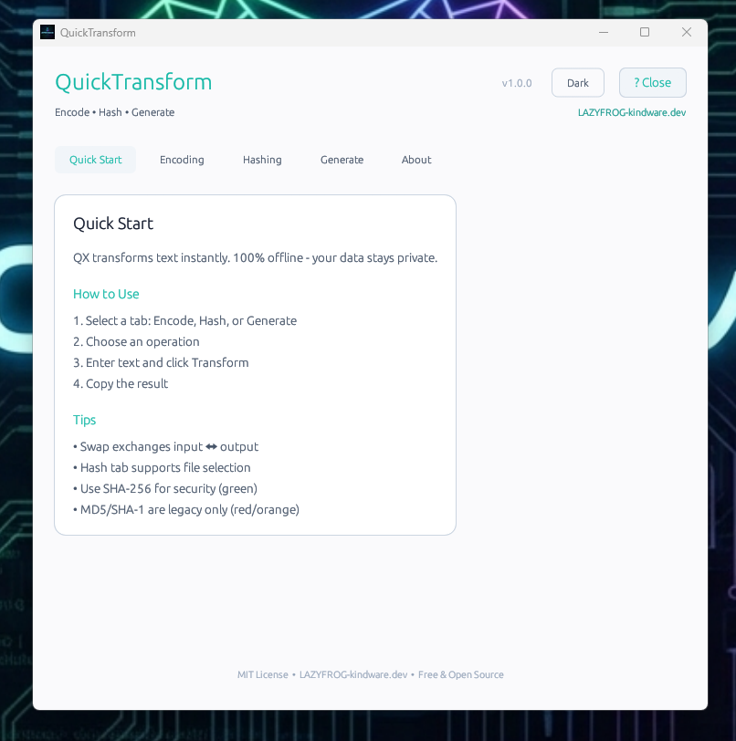

# QuickTransform

[](LICENSE)
[](https://www.rust-lang.org/)
[]()

**Lightning-fast encoder/decoder/hasher for the command line and desktop.**

> **LAZYFROG-kindware.dev** | Free & Open Source

---

## Screenshots

| Dark Theme | Light Theme |
|------------|-------------|
|  |  |
|  |  |

---

## Features

- **Encode/Decode**: Base64, Hex, URL, HTML entities
- **Hash**: MD5, SHA1, SHA256, SHA512 (files or strings)
- **Generate**: UUIDs, secure passwords, random bytes
- **Cross-platform**: Windows, Linux, macOS
- **Pipe-friendly**: Works seamlessly with stdin/stdout
- **GUI included**: Modern graphical interface with dark/light themes
- **Zero network**: All operations offline - no data leaks

---

## Installation

### From Source

```bash
# Clone the repository
git clone https://github.com/Brutus1066/QuickTransform.git
cd QuickTransform

# Build CLI only
cargo build --release

# Build with GUI
cargo build --release --features gui

# Install to system
cargo install --path .
```

### Pre-built Binaries

Download from [Releases](https://github.com/Brutus1066/QuickTransform/releases).

---

## Usage

### Encoding & Decoding

```bash
# Base64
qt b64 "hello world"              # SGVsbG8gV29ybGQh
qt b64d "SGVsbG8gV29ybGQh"        # hello world

# Hex
qt hex "hello"                    # 68656c6c6f
qt hexd "68656c6c6f"              # hello

# URL
qt url "hello world & more"       # hello%20world%20%26%20more
qt urld "hello%20world"           # hello world

# HTML Entities
qt html "<script>alert(1)</script>"
qt htmld "&lt;script&gt;"
```

### Hashing

```bash
# Hash a file
qt sha256 document.pdf
qt md5 archive.zip

# Hash a string
qt sha256 -s "password123"
qt sha512 -s "secret data"

# Hash with all algorithms
qt hash document.pdf
qt hash -s "test"
```

### Generation

```bash
# UUID
qt uuid                           # 550e8400-e29b-41d4-a716-446655440000

# Password (default 16 chars)
qt pass                           # Kj8$mNp2@xLq9#Yw
qt pass 32                        # 32-character password
qt pass 24 --alpha                # Alphanumeric only

# Random bytes
qt randhex 32                     # 64 hex characters (32 bytes)
qt randb64 32                     # 32 bytes as base64
```

### Pipe Support

```bash
echo "secret" | qt b64
cat file.txt | qt sha256
curl -s https://example.com | qt md5
```

### GUI Mode

```bash
# Launch graphical interface
qt-gui
```

---

## Command Reference

| Command | Description | Example |
|---------|-------------|---------|
| `b64` | Base64 encode | `qt b64 "text"` |
| `b64d` | Base64 decode | `qt b64d "dGV4dA=="` |
| `hex` | Hex encode | `qt hex "text"` |
| `hexd` | Hex decode | `qt hexd "74657874"` |
| `url` | URL encode | `qt url "a b"` |
| `urld` | URL decode | `qt urld "a%20b"` |
| `html` | HTML encode | `qt html "<>"` |
| `htmld` | HTML decode | `qt htmld "&lt;"` |
| `md5` | MD5 hash | `qt md5 file.txt` |
| `sha1` | SHA1 hash | `qt sha1 file.txt` |
| `sha256` | SHA256 hash | `qt sha256 file.txt` |
| `sha512` | SHA512 hash | `qt sha512 file.txt` |
| `hash` | All hashes | `qt hash file.txt` |
| `uuid` | Generate UUID | `qt uuid` |
| `pass` | Generate password | `qt pass 24` |
| `randhex` | Random hex | `qt randhex 16` |
| `randb64` | Random base64 | `qt randb64 16` |
| `info` | Show version | `qt info` |

---

## Building

### Requirements

- Rust 1.70 or later
- Cargo

### Build Commands

```bash
# Debug build
cargo build

# Release build (optimized)
cargo build --release

# With GUI feature
cargo build --release --features gui

# Run tests
cargo test
```

---

## License

MIT License - see [LICENSE](LICENSE) for details.

**LAZYFROG-kindware.dev** | Free & Open Source
